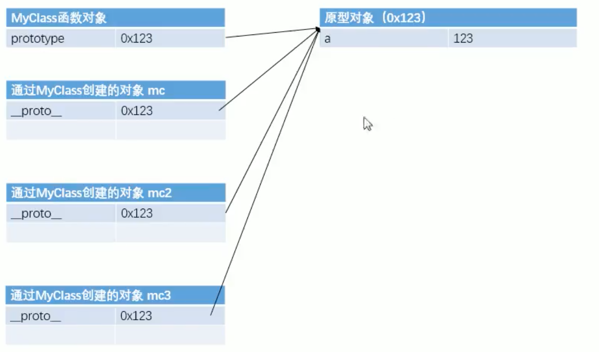

# JavaScript-demo


## 数据类型

JavaScript中一共有5种基本数据类型：

– 字符串型（String） 

– 数值型（Number） 

– 布尔型（Boolean） 

– null型（Null） 

– undefined型（Undefined） 

这5种之外的类型都称为Object，所以总的来看JavaScript中共有六种数

据类型。


### typeof运算符 

返回结果：

– typeof 数值 number

– typeof 字符串 string

– typeof 布尔型 boolean

– typeof undefined undefined

– typeof null object


### String

特殊字符使用转义字符，不带引号则为变量

#### 转字符串有三种方式：

- toString()： a = a.toString() 
  - a不能为null 和 undefined

- String() :  a = String(a)
- 隐式 转换： \+ 拼串 + ”“

### Number

Number 类型用来表示整数和浮点数

Number表示的数字大小是有限的，范围是：

– ± 1.7976931348623157e+308

– 如果超过了这个范围，则会返回± Infinity。 

NaN，即非数值（Not a Number）是一个特殊的数值，JS中

当对数值进行计算时没有结果返回，则返回NaN。

js中整树的运行基本可以保证结果， 0.1 + 0.2 无法运算，计算机运算无法运算1/10

0x 开头： 十六进制

0开头: 八进制

0b开头： 二进制

#### 转换

- 使用Number() ： a = Number(a)
  - 如果不是纯数字会转为NaN
  - 空串转换为0
  - False 0     true 1
- parseInt()
  - 专门转换字符串
  - a = parseInt("234px")   234，只能取整数
  - 使用非string会先转为string 
  - 有些浏览器会解析”070“为8有些会解析成10，为了统一a = parseInt("234px",10)

- \- 通过-0 *1 /1 进行number转换，不是最终方式
- \+ 一元运算符的一个操作转number

### Boolean(布尔型)

#### 转换

- Boolean()
  - 数字，除了0是false
  - 字符串，除了空串为FALSE
  - null和undefined都是false
  - 对象也会转为true
- ! 的操作 !!任意数据类型

### Undefined

### Null


## 运算符

- 算数运算符
  - 对非number的值运算时会，将其转为number再进行运算，NaN和任何值运算都是NaN
  - \+ 字符串操作则为拼串操作
  - \- 通过-0 *1 /1 进行number转换，不是最终方式

一元运算符

- \+ \- 
  - 任何非数值类型的数据，都会先转为数值型，再进行一个运算的操作

自增和自减

逻辑操作符

- ！
  - 任意值运算会先转换成boolean再进行一个取反的操作
- && || 
  - 其他类型的值会先转BOOLEAN再进行运算

非

与

或

赋值运算符

关系运算符

- 对于非数值类型比较时会先转数字
- 任何值和NaN比较都是FALSE
- 如果符号两边都是字符串时，不会将其转换为字符串比较，而会比较unicode的值
  - 所以在比较两个字符串类型的值时一定要注意转型

相等

全等

- 大部分情况都会转换成数字然后比较
  - null == 0 false
  - undefined 衍生自null
  - NaN 不和任何值相等，可以通过isNaN()判断是否是NaN

逗号

条件运算符


## 对象

var obj new Object()

a = "name"

obj[a] = "test"


检查一个对象中是否含有某个属性

语法： 属性名 in 对象


对象的比较是比较的地址值


使用对象字面量创建对象

```js
var ob =  {
	name: "zs"
	"df241!@#": "aaa"
  test: {name: "ls"}
};
```


属性名如果是一些特殊的字符串的话必须加引号


### 函数对象

```js
var fun new Function("console.log('hello world')");

使用函数声明创建函数
function fun2(){
  console.log("hello world");
}

使用函数表达式创建一个函数
var fun3 =  function(){
  console.log("hello world");
}

函数的返回值可以任意值,也可以在函数中返回一个函数

立即执行函数
(function(a,b){
  console.log(a);
  console.log(b);
})(1,2);

对象的属性值也可以是一个函数,称为方法
obj.sayName = function(){
  console.log(obj.name);
}
字面量定义一个对象，属性值为函数
var obj = {
  sayName:function (){
    console.log(obj2.name);
  }
}
```


```js
一个对象中，需要知道对象中有哪些属性，可以枚举出来
for ... in
  for(var n in obj){
    console.log(n)  //n 是对象中的属性名
    console.log(obj[n]) //可以获取对象中属性值
  }
```


### 作用域

- 全局作用域
  - 全局作用域在页面打开时创建，在页面关闭是销毁

  - 在全局作用域中有一个全局对象window,

    - 它代表的是一个浏览器窗口，由浏览器，我们可以直接使用
    - 创建的变量都会作为window对象的属性保存
    - 创建的函数会作为window对象的方法保存

  - 变量的申明提前

    ```js
    console.log(a);
    var a = 123;//会被声明提前
    ```

  - 函数的声明提前

    ```js
    fun();
    function fun(){
      
    }//会在所有代码执行前被调用
    
    //使用函数表达式创建的函数，不会被提前
    fun2();
    var fun2 = function(){}
    ```


- 函数作用域
  - 调用函数时创建一个函数作用域，函数执行完毕后，函数作用域销毁
  - 每调用一次函数就会创建一个新的函数作用域，互相独立
  - 函数作用域中可以访问全局变量，在全局中不能访问到局部
  - 函数中与全局变量相同时，访问的是局部作用域中的变量
  - 函数中要访问全局变量，可以使用window.访问
  - 函数作用域中也有声明提前的现象
  - 函数作用域中也有函数声明提前的现象
  - 在函数中不使用var声明的变量都会变成全局变量
  - 定义形参相当于在函数作用域中声明一个变量


```js
function fun(){
  console.log(this);//会传递一个默认的参数window对象
}
window.fun();
以函数调用时this就是一个window对象，以方法调用，this就是调用对象
```


### 创建对象


使用工厂方法创建对象

```js
function createPerson(name,age,gender){
  var obj = new Object();
	obj.name = name;
  obj.age = age；
  obj.sayHello(){
    console.log("旺旺");
  }
  return obj;
}
var obj1 = createDog()
```

- 使用工厂创建的对象数据类型都是object，无法区分出是哪个对象


构造函数创建对象

- 构造函数习惯首字母大写
- 构造函数的执行流程
  - 立即创建一个新对象
  - 将新对象设置为函数中的this，就是哪个新建的对象，说白了就是哪个per
  - 逐行执行
  - 将对象返回

```js
function Person(){
	alert("");  
}

var per = Person();
不加new 是普通函数

var per = new Person();
加new是一个构造函数

function Person(name,age){
	this.name = name;
  this.age = age;
  this.sayName = function(){
    alert(this.name);
  }
}

console.log(per instanceof Person)
```


### 原型对象

```js
function Person(name,age){
	this.name = name;
  this.age = age;
  this.sayName = fun;
}
function fun(){
  alert(this.name);
}
```

问题： 

- 污染了全局作用域的命名空间
- 定义在全局作用域中很不安全


原型prototype

- 我们创建的每一个函数，解析器都会向函数中添加一个属性prototype

- 如果函数当成普通函数调用，有和没有是一样的

- 当函数一构造函数形式调用时，它所创建的对象中都会有一个隐含的属性

   指向该构造函数的原型对象，我们可以通过\_\_proto\_\_ 来访问该属性

```js
function Person(){}


function MyClass(){}
MyClass.prototype.a = 123;
MyClass.prototype.sayHello = function(){
  alert("hello");
}

var mc = new MyClass();
var mc2 = new MyClass();

mc.__proto__ == MyClass.prototype
mc2.__proto__== MyClass.prototype

mc.a 


```

- 原型对象相当于一个公共区域，所有同一个类的实例都可以访问这个原型对象

- 当我们访问一个对象的属性/方法时，会先访问这个对象中是否有，如果没有




```js
MyClass.prototype.name = "原型中的名字"
var mc = new MyClass();

mc.name

//使用in检查对象中是否含有某个属性时，如果对象中没有但是原型中有，也会返回true
"name" in mc			//true
//可以使用对象的hasOwnProperty()来检查对象自身中是否含有该属性
mc.hasOwnProperty()
```

问题： mc中的hasOwnProperty()哪里来的

```js
mc.__proto__.hasOwnProperty()    //false

mc.__proto__.__proto__.hasOwnProperty()		//true

mc.__proto__.__proto__.__proto__ //null
```

>  使用一个对象中的属性或方法时：首先会去自身中找，如果没找到去原型中找
>
> 如果还没找到，去原型的原型中找，直到找到Object对象的原型，
>
> Object对象的原型没有原型，如果在Object中依然没找到，则返回undefined

### toString 

```js
function Person(name,age){
	this.name = name;
  this.age = age;
}
Person.prototype.toString = function(){
  reutrn "Person[name="+ this.name +",age = "+this.age+"]"
}
```


### call() 和 apply()

在不传递参数时,效果是一样的，都会去调用方法

```js
fun()
fun.call()
fun.apply()
```

call和 appply可以改变函数的this对象

当调用call()和apply()可以将一个对象指定为第一个参数

```js
function fun(){
  alert(this.name);
}
var obj = {name: "obj"}
var obj2 = {name: "obj2"}

fun.call(obj)
fun.apply(obj2)
```

```js
当调用的方法有形参时，
fun.call(obj,a,b)
fun.apply(obj,[a,b])

this的情况
1. 以函数形式调用时，this是window
2. 以方法形式调用时，this是调用方法的对象
3. 以构造函数的形式调用时，this是新创建的哪个对象
4. 使用call和apply调用时，this是指定的哪个对象
```

### arguments

- arguments是一个类数组对象，它可以通过索引来操作数据，也可以获取长度
- 在调用函数时，我们所传递的实参都会在arguments中保存
- arguments.length可以用来获取实参的长度
- 我们即使不定义形参，也可以通过arguments来使用实参，只不过比较麻烦
  - arguments[0] 第一个实参
  - arguments[1] 第二个实参
- 它里面有个属性 callee
  - 这个属性对应一个函数对象，就是当前正在指向的函数的对象

```js
function fun(a,b){
  console.log(arguments instanceof Array)
  console.log(Array.isArray(arguments))
	console.log(arguments.length)
	console.log(arguments[1])
  console.log(arguments.callee)
}
```


## 内建对象

Array、Booelan、Date、Math、Number、String、RegExp、Functions、Events

宿主对象

自定义对象


### 数组（Array）

- 数组也是一个对象，数组使用数字作为索引操作元素

```js
var arr = new Array(1,2,23);
var arr = new Array(10);//创建一个长度为10的数组
var arr = [10]
var arr = [1,2,3]
arr[0] = 10;
arr[1] = 23;


arr.length	//获取连续数组中的元素个数
arr.length = 5 //多出的部分会空出来，多出的元素会删除
arr[arr.length] = 12//永远会想数组的最后一个位置添加元素
```

```js
数组中方法
push();
	- 向数组末尾添加一个或多个元素
	- 返回值: 添加后的数组的长度
	arr.push(1,2,3,4);

pop()
	- 删除数组的最后一个元素
	- 返回值: 返回删除的元素
	arr.pop()

unshift()
	- 向数组开头添加一个或多个元素，并返回新数组长度
	arr.unshift(1,2,3,4)

shift()
	- 删除数组第一个元素，并将删除的元素作为返回值返回
	arr.shift();

slice()
	- 从某个数组中返回选定的元素
	- 返回一个新数组
	- 可以传递负值，可以只传递一个参数
	arr.slice(start,end)

splice()
	- 使用splice()会将指定元素从原数组中删除
	- 第二个参数表示删除的数量
	- 第三个及以后，会插入开始索引位置
	arr.splice(start,num,1,2,3,4);

concat()
	- 连接两个或多个数组，将新数组返回
	arr1.comcat(arr2,arr3,"1","2")

join()
	- 将数组转换成一个字符串返回,默认以逗号连接
	arr.join(“-”)

reverse()
	- 反转数组
	- 会影响原数组
sort()
	- 对数组的元素进行排序，按照Unicode编码排序
	- 会影响原数组
	可以指定排序规则,定义回调:参数是数组中的元素
  	- 返回值 > 0换位， < 0 不调换位置 = 0 相等
  arr.sort(function(a,b){
    reurn a - b; //升序排列
  })

```

数组的遍历

```js
for(var i = 0; arr.length; i++){
  console.log(arr[i]);
}

//forEach遍历IE8以上
arr.forEach(function(value,index,obj){ //该函数，由我们创建，不由我们调用的方法称为回调函啊
  //浏览器会在回调函数中传递3个参数
})
```

数组去重

```js
var arr = [1,2,3,3,2,2,3,4,5,6,5,4,4,3,2]
for(var i = 0; i < arr.length ; i++){
  for(var j = i + 1 ; j < arr.length ; j++){
    if(arr[i] == arr[j]){
      arr.splice(j,1);
      j--;
    }
  }
}
```


### Date

```js
var d = new Date(); //当前时间

var d2 = new Date("12/03/2016 11:10:30");

d.getDate //获取日期 是几日
d.getDay()//获取周几 0周日 1周一
d.getMonth()	//获取月份 0 一月
d.getFullYear()//获取年份
d.getTime	//获取当前日期对象的时间戳
Date.now();//获取当前时间戳

```


### Math

```js
Math是一个工具类，
Math.PI
Math.abs(-1) 		//1
Math.ceil(1.4) 	//2
Math.floor(1.5) //1
Math.round(1.5) //2
Math.random()		//生成0-1之间的数
	- Math.round(Math.random()*10)    //0 - 10
	- //x - y   Math.round(Math.random()*(y - x) + x)
max 
min
pow(x,y)//x的y次幂
sqrt()//开方

```


### String 、Number 、 Boolean

包装类

```js
var num = new Number(3);
var str = new String("hello")
var bool = new Boolean(true);
```


length

```js
str[i]
str.charAt(i)


charCodeAt(i)//返回Unicode的编码
fromCharCode()//根据字符编码获取字符

String.fromCharCode(ox2692);

str.concat("zs","666")//返回一个新的字符串
str.indexOf("h")//第二个参数指定查找的开始的索引
lastIndexOf("h")//从后往前找

slice(start,end)//截取字符串(start,end],第二个参数可省略，也可以是负数
subString(start,end) //不同的是不能接收负值，会自动调整参数的位置
subStr()//参数一，开始的位置，参数二，截取的个数

split()//将字符串拆分成一个数组
toLowerCase()//将一个字符串转为小写的
toUpperCase()//将一个字符串转为大写的
```

### RegExp

正则表达式： 

```js
var reg = new RegExp("a","i")//忽略大小写，有就行
var reg = /正则表达式/匹配模式//使用字面量创建更简单，使用构造更灵活
var reg = /a/i;	
var flag = reg.test(str)


var reg = /a|b|c/i;	 //有a 或 b 或c

var reg = /[ab]/	//[] 也是或的关系
[ab] == a|b
[^ab] 除了
[a-z]任意小写
[A-Z]任意大写
[A-z]任意字母
[0-9]任意数字

var str = "1r2h2h3k5h6h"
var result = str.split(/[A-z]/);
console.log(result);

search()

match(/[A-z]/gi);//返回的是一个数组

replace(/a/gi,"")//可以将字符串中指定内容替换为新的内容
```


